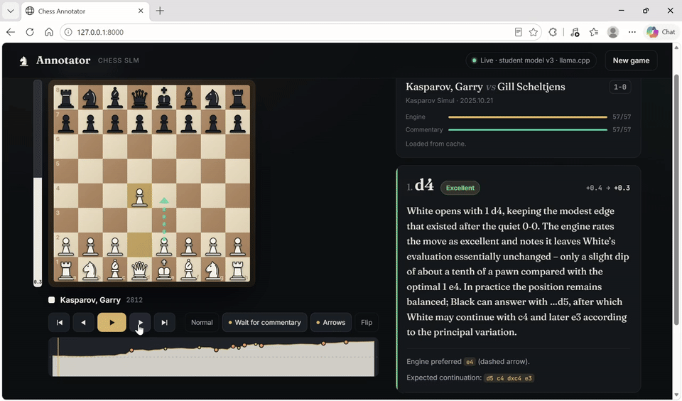
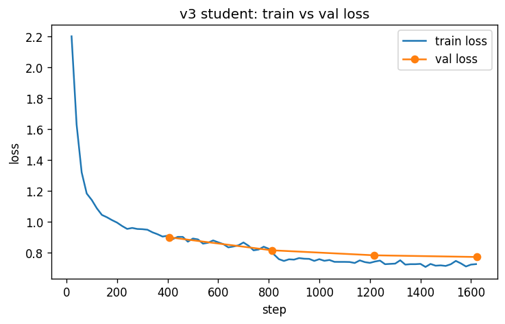

# Chess Annotator

Load a chess game, watch it play out on the board, and read a short commentary on every move as it happens.



The commentary comes from a small language model (Qwen2.5-1.5B) that I trained for this job. It never works out the chess on its own. Stockfish and some board analysis code decide the facts for each move: the evaluation before and after, the best alternative, the likely reply, and ideas such as pins, forks, open files or pawn structure. The model only turns those facts into a few readable sentences. That keeps it small enough to run on an ordinary laptop CPU with no GPU and no API costs.

## What you can do with it

* Drop in a PGN file or paste one. Files with many games give you a searchable list to pick from.
* Step through the game with the arrow keys, or press Space to play it. Playback waits for each comment to arrive, so the text always matches the position on the board.
* See the evaluation bar, a graph of the evaluation over the whole game (click it to jump to a move), and the engine's preferred move drawn as a dashed arrow whenever the played move wasn't the best one.
* Any comments or arrows already in your PGN are shown next to the generated commentary.
* Export the game as a PGN with all the commentary and evaluations included.

## Running it

You need Python 3.10 or newer, a Stockfish binary and the model file.

**1. Install the Python packages**

```bash
pip install -r requirements.txt -r requirements-app.txt
```

**2. Get Stockfish**

Download it from [stockfishchess.org](https://stockfishchess.org/download/) (on Linux, `apt install stockfish` also works) and note where the binary is.

**3. Get llama.cpp**

The model runs through `llama-server` from [llama.cpp](https://github.com/ggml-org/llama.cpp). Download a prebuilt release for your system from the [releases page](https://github.com/ggml-org/llama.cpp/releases). On Windows, take the file ending in `bin-win-cpu-x64.zip` and unzip it anywhere.

**4. Get the model**

Download `student-v3-q8_0.gguf` (1.6 GB) from [Hugging Face](https://huggingface.co/shashank-v-98/chess-annotator-qwen2.5-1.5b-gguf) and put it in this folder. You can also build it yourself from the LoRA adapter; see "Rebuilding the model file" below.

**5. Start the app**

```bash
export COMMENTATOR_BACKEND=student_gguf
export STUDENT_GGUF=student-v3-q8_0.gguf
export LLAMA_SERVER=/path/to/llama-server          # llama-server.exe on Windows
export STOCKFISH_PATH=/path/to/stockfish
python -m uvicorn webapp.server:app --port 8000
```

Open http://127.0.0.1:8000. The app starts `llama-server` on its own and shuts it down when you stop the app.

On a laptop CPU, expect about 16 seconds per comment. Stockfish analyses the whole game in the background while the comments are written one at a time in move order, and finished games are cached, so opening the same game again is instant.

To try the interface without the model, set `COMMENTATOR_BACKEND=mock`. It still runs Stockfish but fills in placeholder comments.

Every setting (engine depth, ports, threads, rate limits and so on) is listed in [webapp/README.md](webapp/README.md).

## How the model was trained

The goal was a small model that writes like a good annotator while only saying things the engine actually supports. I trained it by distillation: a large model wrote example commentary from verified facts, and the small model learned to copy it.

**Games.** Real games from Chess.com's public API (`distill/fetch_chesscom_games.py`): my own games plus games from eleven strong online players, so the data covers everything from club level play to grandmaster games.

**Facts.** Each game goes through Stockfish at depth 14. `chess_annotator/features.py` records the evaluations, the best move and the expected line for every move, and `chess_annotator/positional.py` finds the human ideas: pins, forks, open files, weak pawns, the type of endgame and so on.

**Teacher labels.** `distill/generate_app_dataset.py` picks which moves to label (every mistake and blunder, moves with a notable idea, and a sample of the rest) and asks gpt-oss-120b to comment on each one using only the facts. A second pass with the same model checks each comment against the facts and fixes anything that doesn't match. This produced 16,384 labelled moves for $25.94.

**Filtering.** `distill/consistency.py` is a rule checker that compares every comment with its facts: the size and direction of the advantage, which side is better, captures and checks that really happened, tactics that really exist, and pieces on the squares they really stand on. The 7.1% of labels that failed were dropped, leaving 15,217.

**Splits.** `distill/build_v3_split.py` splits the data by game, so no game appears in more than one split: 13,001 moves for training, 1,071 for validation and 1,145 for testing.

**Training.** `distill/train_v3_on_kaggle.ipynb` trains a LoRA adapter on Qwen2.5-1.5B-Instruct on a single Kaggle T4 GPU:

| Setting | Value |
|---|---|
| LoRA rank / alpha / dropout | 32 / 64 / 0.05 |
| Target modules | all attention and MLP projections |
| Epochs | 2 |
| Learning rate | 1e-4, cosine schedule, 3% warmup |
| Effective batch size | 16 (2 × 8 gradient accumulation) |
| Max sequence length | 1024 tokens |

Validation loss went from 0.899 to 0.772 over the run.



**Results on the 1,145 test moves** (full outputs in [results/v3_test_outputs.json](results/v3_test_outputs.json)):

* 96.7% of the model's comments passed the consistency checker.
* On all 193 test moves that were mistakes or blunders, it named the engine's best move.
* No empty or cut off comments, and comment length is about the same as the teacher's.

The checker is strict about what it flags but can't catch everything, so the true error rate is somewhat higher than 3.3%.

## Rebuilding the model file

The app runs the model as an 8 bit GGUF file through llama.cpp. To build that file from the LoRA adapter:

```bash
# merge the adapter into the base model
python -m distill.export_student_gguf --adapter path/to/chess-annotator-lora-v3

# convert with the script from a llama.cpp checkout
git clone --depth 1 https://github.com/ggml-org/llama.cpp
pip install sentencepiece protobuf
python llama.cpp/convert_hf_to_gguf.py student-v3-merged --outtype q8_0 --outfile student-v3-q8_0.gguf
```

To confirm the conversion didn't hurt quality, start `llama-server` with the new file on port 8081 and run:

```bash
python -m distill.eval_gguf --n 150
```

On a sample of 150 test moves, the 8 bit model passed the checker on 98.0% of comments, against 98.7% for the original model on the same moves ([results/v3_gguf_q8_eval.json](results/v3_gguf_q8_eval.json)).

## Project layout

```
chess_annotator/   engine analysis, positional ideas, prompts
distill/           data collection, labelling, filtering, training notebook, export and evaluation
webapp/            FastAPI server and the browser app (webapp/static/index.html)
examples/          sample games and example model output
results/           loss curve, test set outputs, GGUF evaluation
```

## License

MIT. Qwen2.5-1.5B-Instruct is released under Apache 2.0. Stockfish is GPL and isn't included here; you download it separately.
